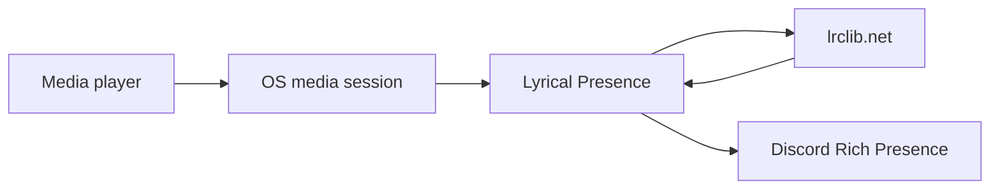

# Lyrical Discord Presence

Music Presence's application source code is **not** published in this repository
(see [LICENSE.md](../LICENSE.md)). Binary redistribution without modification
is allowed; the Qt/C++ app itself cannot be patched from this repo.

This fork adds a companion tool under [`lyrical-presence/`](../lyrical-presence/)
that displays **synced lyrics line-by-line in Discord Rich Presence**.

## How it works

1. Read the currently playing track from the OS media session
   (MPRIS / `playerctl` on Linux, SMTC on Windows, Apple Music on macOS).
2. Fetch timed lyrics from [LRCLIB](https://lrclib.net) (no API key).
3. Match the playback position to the active LRC line.
4. Update Discord Rich Presence whenever the lyric line changes
   via the official local Discord RPC (no user token).



## Status layout

- **Details:** current lyric sentence/line
- **State:** `Artist — Title · Player`
- Falls back to title/artist when synced lyrics are missing

## Quick start

See the full guide: [lyrical-presence/README.md](../lyrical-presence/README.md)

```bash
cd lyrical-presence
python3 -m venv .venv && source .venv/bin/activate
pip install -e .
lyrical-presence --client-id YOUR_DISCORD_APP_ID
```

## Relationship to Music Presence

| | Music Presence | Lyrical Presence |
| --- | --- | --- |
| Album covers / player controls | Yes | No |
| Line-synced lyrics in Discord | No | Yes |
| Works with many players | Yes | Yes (via OS media APIs) |
| Source available here | No (docs only) | Yes |

You can run both together (different Discord application IDs) or use Lyrical Presence alone when you want lyrics in your status.
